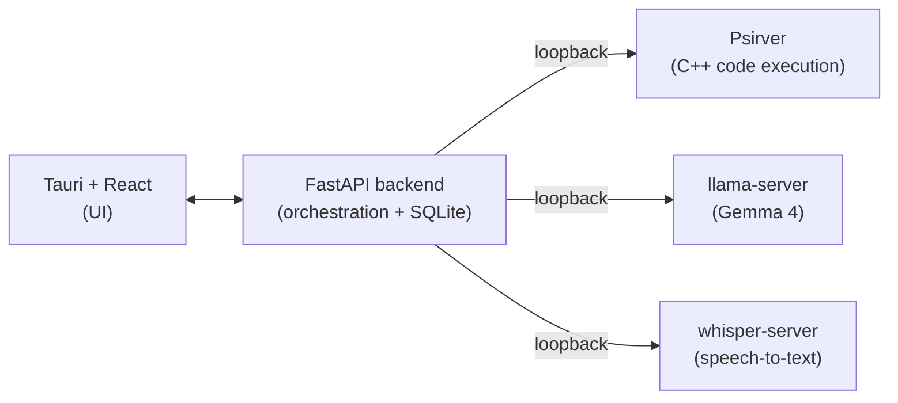

# Whetstone

**A local-first problem-solving environment for CS students. Your code, your reasoning, and an AI tutor - all on your own machine.**


-lightgrey)


> A whetstone is what you sharpen a blade against. This is a surface to sharpen problem-solving skill against - not a machine that hands over answers.

---

## What it is

Whetstone is a desktop app for working through a CS assignment end to end: read the spec, write and run code, get unstuck, and look back at how you got there. It runs an interpreter and an AI tutor locally, so nothing you write leaves your laptop.

Three things make it different from a notebook with a chatbot bolted on:

- **It understands your assignment.** Import a spec (PDF or text) and Whetstone turns the wall of text into a tracked checklist of requirements you can check off as you go.
- **It tutors instead of solving.** A Socratic mode answers your questions with questions and incremental hints. When you genuinely want the answer, you can ask for it - and the app tells you plainly when it's handing you a full solution versus a nudge.
- **It records how you think.** Every edit, run, error, and AI exchange goes into a session timeline you can replay. Think of it as a debugger for your own problem-solving process.

## Why I built it

Most AI coding help is cloud-based and answer-shaped. That's a bad fit for two reasons students feel directly: privacy (your code and your professor's spec get shipped to someone else's server) and learning (a tool that just writes the answer teaches you nothing and walks straight into academic-integrity trouble).

Whetstone takes the opposite stance. Everything runs offline by default, and the design treats the AI as a fallible tutor whose reasoning you verify, not an oracle you copy. The point is to come out the other side actually understanding the problem.

## Status

v1.0. The requirements are specified (see [`docs/Whetstone_SRS.md`](docs/Whetstone_SRS.md)), and the functional core is in and tested: code execution (Python + C++), the Direct and Socratic tutor modes, spec import with requirement tracking, the session event log, and on-device voice dictation. The release also adds execution hardening, restricted CORS, CI, and a one-command launcher with a macOS bundle. The table below reflects what runs today; the remaining edges are named under [Known limitations](#known-limitations) and [Roadmap](#roadmap).

| Area | State |
|---|---|
| Software Requirements Spec | Done |
| Psirver async job system (fork/exec, lifecycle, capture) | Done |
| Backend API (sessions, cells, spec, timeline) | Done |
| Cell execution (backend ↔ Psirver, Python + C++) | Done |
| Notebook UI (run / edit / add cells, restored on open) | Done |
| Spec import + requirement tracking | Done |
| Local LLM co-pilot — Direct mode | Done |
| Local LLM co-pilot — Socratic mode | Done |
| Session event log + timeline endpoint | Done |
| Timeline replay (step-back scrubber over the event log) | Done |
| Voice input (Whisper STT → co-pilot dictation) | Done |
| Execution hardening (per-job rlimits, fd hygiene, env scrubbing) | Done |
| Restricted CORS + production error handling | Done |
| CI (backend + frontend tests) | Done |
| Packaging / one-command run | `make dev` launcher + macOS Tauri bundle (UI shell — services run separately) |

## Architecture

Whetstone is a Tauri + React front end over a local FastAPI backend. The backend talks to three separate local services over loopback (`127.0.0.1`), so a misbehaving model or a runaway program can't take down the rest of the app, and swapping the model is a restart rather than a code change.



Code execution runs through **Psirver**, a C++ HTTP server I originally wrote for an Operating Systems course. It uploads scripts, runs them with `fork`/`execvp`, and tracks each run as a job with captured stdout/stderr, status, and termination. Reusing it here gives Whetstone a sandboxed, independently restartable execution engine - and a real answer to "why an HTTP server inside a local app?" (reuse, isolation, and a clean seam if remote execution ever matters).

## Code execution & sandboxing

Whetstone runs user- and AI-suggested code through Psirver, which binds to `127.0.0.1` only and runs each cell as an isolated `fork`/`execvp` job. Because submitted code may be AI-generated, an unguarded child could trivially take down the host with an infinite loop, a runaway allocation, an output flood, or a stray `fork`. The v1.0 security floor (SRS NFR-SEC-1) contains those cases: before `exec()`, each forked child is wrapped as follows.

- **Resource caps** (`setrlimit`): `RLIMIT_CPU` (CPU seconds), `RLIMIT_AS` (virtual address space), `RLIMIT_FSIZE` (max bytes any single file may grow), and `RLIMIT_CORE = 0` (no core dumps from a killed runaway).
- **Wall-clock deadline**: `RLIMIT_CPU` only catches code that *burns* CPU; a job that sleeps or blocks on I/O would hang forever. A reaper thread enforces a hard wall-clock deadline, reusing the terminate path - `SIGTERM` the job's process group, then `SIGKILL` after a grace window - so a timed-out job surfaces as `TERMINATED` instead of hanging. (The backend's own ~30 s poll ceiling sits *above* this deadline, so Psirver always terminates the job first.)
- **Private working directory**: the child `chdir`s into a per-job scratch dir (`jobs/<id>/`); the compiled C++ binary and any stray writes land there, and `HOME`/`TMPDIR` point at it.
- **Minimal environment**: the child does *not* inherit the server's environment (which may hold secrets/tokens). It is handed only `PATH` (so `execvp` can find `python3`/`clang++`), `HOME`, `TMPDIR`, and a few `LANG`/`PYTHON*` hints. (On macOS the system re-injects a non-sensitive `__CF_USER_TEXT_ENCODING` locale hint; that is expected and harmless.)
- **File-descriptor hygiene**: `stdin` is redirected from `/dev/null`, `stdout`/`stderr` go to per-job capture files, and every other inherited descriptor (the listening socket, the request's client socket) is closed so the job cannot reach the server's fds.
- **Own process group**: each job is its own process group leader, so the whole subtree - including a fork-bomb attempt or the C++ compile/run pair - is killed as a unit (`kill(-pgid, ...)`). This is what makes a multi-process runaway *reliably* killable.

### Configurable limits

Defaults suit a single-file Python/C++ assignment and can be overridden at startup via environment variables:

| Variable | Default | Meaning |
| -------- | ------- | ------- |
| `PSIRVER_LIMIT_CPU_SECONDS` | `10` | `RLIMIT_CPU` soft+hard cap |
| `PSIRVER_LIMIT_AS_MB` | `2048` | `RLIMIT_AS` (virtual memory); `0` disables |
| `PSIRVER_LIMIT_FSIZE_MB` | `64` | `RLIMIT_FSIZE` per-file cap |
| `PSIRVER_LIMIT_WALL_SECONDS` | `15` | reaper wall-clock deadline; `0` disables |
| `PSIRVER_LIMIT_KILL_GRACE_SECONDS` | `3` | `SIGTERM` -> `SIGKILL` escalation window |

The `RLIMIT_AS` default is deliberately generous: clang++ and language runtimes *reserve* large virtual ranges they never touch, so too tight a cap fails legitimate work. 2 GiB lets a normal compile/run through while still catching a genuine multi-GB allocation. **Caveat:** `RLIMIT_AS` is enforced on Linux (the realistic deployment) but is effectively a *no-op on macOS* - there the wall-clock deadline is the cross-platform backstop that contains a memory runaway. There is no `RLIMIT_NPROC` cap because it is a per-real-user absolute count that would break a normal multi-process desktop; fork containment instead comes from process-group `SIGKILL` (and, on Linux, cgroup `pids.max` is the proper knob if stricter isolation is ever required).

### Threat model

This is a **local, single-user** application: Psirver binds `127.0.0.1` only, and the only client is the Whetstone backend on the same machine. The goal of these limits is to **contain runaway or accidentally-abusive code** - a student (or an AI suggestion) producing an infinite loop, a memory hog, an output flood, or an unintended `fork` - so a bad cell degrades into a `FAILED` / `TERMINATED` job instead of taking down the host.

The limits are **explicitly not** a security sandbox against a *determined local attacker who already controls the machine*. Such an attacker has the user's own privileges and can bypass these process-level caps; defending against them is a non-goal at v1.0. Stated plainly so the limits are not mistaken for more than they are.

**Out of scope (v1.0):**

- **Filesystem isolation.** The job runs as the same user and can read files that user can read; the scratch `chdir` and minimal env reduce accidental blast radius but are not a chroot/jail. (Future: a `chroot`/container or a dedicated low-privilege `psirver` user.)
- **Network isolation.** A job may open outbound sockets. (Future: a network namespace or seccomp filter on Linux.)
- **Syscall filtering.** No seccomp-bpf allowlist; a job may invoke any syscall available to the user.
- **Privilege separation.** Psirver runs as the invoking user, not a dedicated unprivileged account.
- **Defeating a determined local attacker**, side channels, or hardening of the HTTP parser beyond existing bounds.
- **`RLIMIT_AS` on macOS** (no-op; see the caveat above).

### Verifying containment

`services/psirver/src/limits_demo.sh` builds Psirver, launches it with deliberately tight limits, and submits a battery of abusive jobs (CPU loop, output flood, memory hog, blocking sleep, fork tree, plus normal Python/C++ jobs as no-false-positive controls), asserting each is contained:

```sh
cd services/psirver/src
./limits_demo.sh   # prints PASS/FAIL per case, exits non-zero on any failure
```

## Tech stack

| Layer | Choice |
|---|---|
| Frontend | Tauri + React |
| Backend | FastAPI (Python) |
| Storage | SQLite via SQLModel, with sqlite-vec for semantic search |
| Inference | llama.cpp (`llama-server`), Gemma 4 E4B minimum / 26B A4B recommended |
| Speech-to-text | Whisper (`whisper-server`) |
| Code execution | Psirver (C++), Python and C++ cells |

The stack is shared on purpose across a three-app suite (see below), so the choices read as deliberate architecture rather than three unrelated projects.

## Part of a suite

Whetstone is the third app in a privacy-first student suite:

- **LoomAssist** - local-first calendar and voice assistant for scheduling.
- **Chalkmark** - local-first AI study and note-taking app with branchable, git-style note versions.
- **Whetstone** - this project: the assignment problem-solving environment.

It borrows its backend shape from LoomAssist (Tauri + FastAPI + SQLModel) and its semantic search from Chalkmark (sqlite-vec). The apps run independently but are built to interoperate where it's natural.

## Getting started

Target platform is **macOS on Apple Silicon**. The four backend services come up
with one command (`make dev`); the desktop window is started separately.

### Prerequisites

- macOS on Apple Silicon, 16 GB RAM baseline.
- **Xcode Command Line Tools** — `clang++` for the Psirver build and C++ cells:
  `xcode-select --install`.
- **Python 3.11+** (`python3`).
- **Node.js 18+** and npm.
- **Rust toolchain** + [Tauri prerequisites](https://tauri.app/start/prerequisites/) —
  only needed to build the bundle or run `npm run tauri dev`. You can skip Rust
  and run the UI in a browser (`npm run dev`) instead.
- **`llama.cpp`** built so `llama-server` is on your `PATH` (the LLM co-pilot).
- **`whisper.cpp`** built so `whisper-server` is on your `PATH` (voice input).
- The **model files** (next section). The app's tutor and voice features are
  useless without them.

### Getting the models

The model files are large and are **not** in the repo. By default the launcher
looks in [`models/`](models/) (gitignored); override the paths with
`WHETSTONE_GEMMA_GGUF` and `WHETSTONE_WHISPER_GGML`.

`apps/backend/config.py` only stores the model *names* the backend sends to each
server (`gemma-4-e4b`, `whisper-base`); it never stores a file path. The *path*
is passed to the server by the launcher via `-m`. So "where the model lives" is
a launcher/env concern, and "what it's called" is a config concern.

**1. Gemma GGUF → `models/gemma-4-e4b.gguf`** (for `llama-server`)

Whetstone targets a **Gemma E4B-class** model (the 16 GB-friendly floor; a
larger Gemma is the recommended upgrade — see [`docs/model-eval.md`](docs/model-eval.md)).
The default is the instruction-tuned **Gemma 4 E4B** GGUF published by the
llama.cpp team ([`ggml-org/gemma-4-E4B-it-GGUF`](https://huggingface.co/ggml-org/gemma-4-E4B-it-GGUF)).
Download the `Q4_K_M` quant (~5.3 GB — a good size/quality balance) and save it
at the default path:

```sh
huggingface-cli download ggml-org/gemma-4-E4B-it-GGUF gemma-4-E4B-it-Q4_K_M.gguf \
  --local-dir models --local-dir-use-symlinks False
mv models/gemma-4-E4B-it-Q4_K_M.gguf models/gemma-4-e4b.gguf
```

(Or point `WHETSTONE_GEMMA_GGUF` at wherever you already keep it. llama.cpp's
`llama-server -hf ggml-org/gemma-4-E4B-it-GGUF:Q4_K_M` can also fetch on first
run, but the launcher wants a local file it can preflight, so the documented
default is a file in `models/`.)

**2. Whisper model → `models/ggml-base.bin`** (for `whisper-server`)

whisper.cpp ships a downloader that produces exactly the file we want:

```sh
# from your whisper.cpp checkout:
bash ./models/download-ggml-model.sh base
cp models/ggml-base.bin /path/to/Whetstone/models/ggml-base.bin
```

`base` matches the `whisper-base` name in config. A larger model (`small`,
`medium`) also works — set `WHETSTONE_WHISPER_GGML` to its path.

### Build and run

```sh
# 1. Start the four local services (backend, Psirver, llama-server, whisper-server).
#    First run builds Psirver and the backend venv automatically.
make dev
#    No models yet? Bring up just the backend + Psirver:
make dev ARGS="--skip-llm --skip-stt"

# 2. In a second terminal, start the desktop window:
cd apps/desktop && npm run tauri dev
#    No Rust/Tauri toolchain? Run the UI in a browser instead:
cd apps/desktop && npm run dev   # then open http://localhost:1420
```

`make dev` prints each service, its port, and whether it came up; **Ctrl-C**
tears all four down and frees their ports. If a model file, the Psirver binary,
or a port is missing it fails up front with the exact reason rather than coming
up half-wired. Full detail — ports, env vars, troubleshooting — is in
[`RUNNING.md`](RUNNING.md), and [`SMOKE_TEST.md`](SMOKE_TEST.md) is a click-by-click
acceptance pass.

### Packaging (macOS bundle)

```sh
make bundle    # = cd apps/desktop && npm install && npm run tauri build
```

This produces a `Whetstone.app` and a `.dmg` under
`apps/desktop/src-tauri/target/release/bundle/`. **The bundle packages only the
UI shell** — it does not embed the backend or the model servers. Run `make dev`
alongside the bundled app so it can reach the backend on loopback (the bundled
app's `tauri://localhost` origin is already allow-listed in the backend's CORS
config). Bundling the services as sidecars is a post-v1 item.

## Repository layout

This is a monorepo. The two apps and the standalone execution service are
developed and run independently.

```
whetstone/
├── apps/
│   ├── desktop/            # Tauri + React (TypeScript) front end
│   └── backend/            # FastAPI backend
│       ├── main.py         # app factory, mounts routers
│       ├── db.py           # SQLite engine + session factory (SQLModel)
│       ├── models.py       # SQLModel tables (Session, Cell, Spec, Event, …)
│       ├── config.py       # pydantic-settings configuration
│       ├── routers/        # sessions, cells, ai, spec
│       └── services/       # psirver / llm / stt / spec HTTP clients
├── services/
│   └── psirver/            # C++ code-execution service (fork/exec job runner)
├── scripts/                # dev.sh — one-command local launcher
├── docs/                   # SRS and design docs
├── Makefile                # make dev / make bundle
└── README.md
```

## Running locally (development)

`make dev` (see [Build and run](#build-and-run)) is the one-command path and the
recommended way to bring up the stack. To run a single service by hand — for
example the backend with `--reload` for hot-reloading, or one model server in
isolation — follow the per-service steps in [`RUNNING.md`](RUNNING.md). The
desktop app talks to the backend over loopback; the backend in turn talks to
Psirver, llama-server, and whisper-server over loopback (see
[Architecture](#architecture)).

## Roadmap

**Shipped in v1.0**

- Psirver async job system (the execution spine) with Python + C++ cell execution.
- Notebook workspace: run, edit, and add cells; cells restored when a session opens.
- Spec import → tracked requirement checklist.
- On-device LLM co-pilot in both Direct and Socratic modes.
- Session event log + timeline endpoint, with a step-back replay scrubber that
  reconstructs session state at any point (view-only — it never re-runs code).
- On-device voice dictation into the co-pilot prompt (Whisper).
- Execution hardening (per-job rlimits, fd hygiene, environment scrubbing),
  restricted CORS with loud-failure error handling, CI for backend and frontend,
  and a one-command dev launcher plus a macOS Tauri bundle.

**Future / stretch**

- Moving the academic-integrity marker guarantee server-side so it no longer
  depends on a small model emitting it (see [`docs/model-eval.md`](docs/model-eval.md) §B).
- Bundling the backend and model servers as Tauri sidecars so the app is a single launch.
- Session branching, suite interop (LoomAssist / Chalkmark), and export polish.
- Sandbox hardening beyond the v1.0 security floor.

See the [SRS](docs/Whetstone_SRS.md) for the full requirements, diagrams, and design decisions.

## Known limitations

v1.0 ships a complete core. These are the edges it knowingly leaves for later —
named here on purpose rather than hidden:

- **The co-pilot mode resets to Direct on a full reload.** Direct/Socratic is
  in-memory UI state; a full page reload (browser dev mode, or a webview reload)
  drops back to Direct rather than restoring the last-used mode.
- **The academic-integrity marker is best-effort on a small model.** When the
  tutor hands over a full solution it is asked to prepend a
  `[FULL SOLUTION …]` banner, but a small on-device model emits that marker only
  unreliably. v1.0 leans on the always-on "verify this" framing instead of
  guaranteeing the banner; making the guarantee server-side is a documented
  follow-up (see [`docs/model-eval.md`](docs/model-eval.md) §B).
- **The workspace breadcrumb is a cosmetic label.** The header always reads
  `scratchpad.cpp` regardless of whether the active cell is Python or C++ — it
  is a brand-style breadcrumb, not the real per-cell filename.
- **The bundle ships the UI shell only.** The macOS bundle packages the desktop
  UI; the backend and the three model/exec services are launched separately via
  `make dev`. Sidecar packaging is post-v1.
- **Model-quality numbers are provisional.** The model-eval harness is in place,
  but the empirical scores (complexity reliability, marker miss-rate) have not
  been run against a live model, so the "E4B floor / larger-Gemma recommended"
  guidance is a reasoned default, not a measured one
  (see [`docs/model-eval.md`](docs/model-eval.md)).

## License

Whetstone is released under the **[Apache License 2.0](LICENSE)**.

`services/psirver/` originated as an Operating Systems course project and is
included here under the same license.

---

*Built by Allan as part of an ongoing exploration of local-first, privacy-respecting tools for students.*
