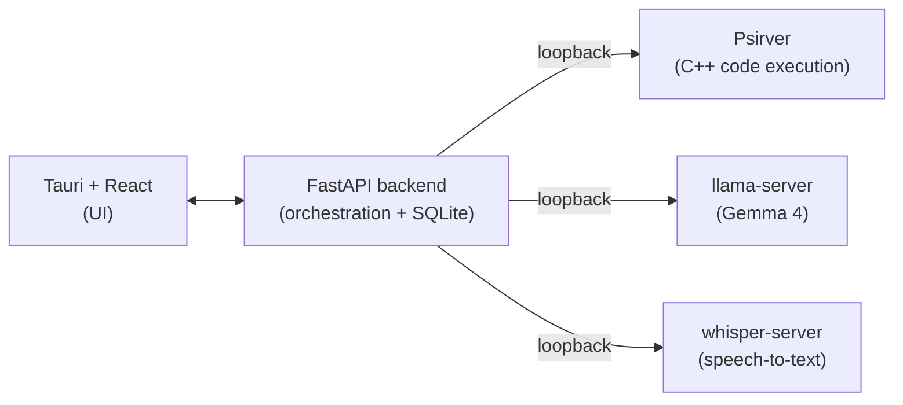

# Whetstone

**A local-first problem-solving environment for CS students. Your code, your reasoning, and an AI tutor - all on your own machine.**


-lightgrey)


> A whetstone is what you sharpen a blade against. This is a surface to sharpen problem-solving skill against - not a machine that hands over answers.

---

## What it is

Whetstone is a desktop app for working through a CS assignment end to end: read the spec, write and run code, get unstuck, and look back at how you got there. It runs an interpreter and an AI tutor locally, so nothing you write leaves your laptop.

Three things make it different from a notebook with a chatbot bolted on:

- **It understands your assignment.** Import a spec (PDF or text) and Whetstone turns the wall of text into a tracked checklist of requirements you can check off as you go.
- **It tutors instead of solving.** A Socratic mode answers your questions with questions and incremental hints. When you genuinely want the answer, you can ask for it - and the app tells you plainly when it's handing you a full solution versus a nudge.
- **It records how you think.** Every edit, run, error, and AI exchange goes into a session timeline you can replay. Think of it as a debugger for your own problem-solving process.

## Why I built it

Most AI coding help is cloud-based and answer-shaped. That's a bad fit for two reasons students feel directly: privacy (your code and your professor's spec get shipped to someone else's server) and learning (a tool that just writes the answer teaches you nothing and walks straight into academic-integrity trouble).

Whetstone takes the opposite stance. Everything runs offline by default, and the design treats the AI as a fallible tutor whose reasoning you verify, not an oracle you copy. The point is to come out the other side actually understanding the problem.

## Status

In active development. The requirements are specified (see [`docs/Whetstone_SRS.md`](docs/Whetstone_SRS.md)) and the current work is the execution backend. This README describes the v1.0 target; not everything below runs yet.

| Area | State |
|---|---|
| Software Requirements Spec | Done |
| Psirver job system (async exec) | In progress |
| Notebook + cell execution | Planned |
| Local LLM co-pilot | Planned |
| Spec parsing + tracking | Planned |
| Session timeline + replay | Planned |
| Socratic mode, voice input | Planned |

## Architecture

Whetstone is a Tauri + React front end over a local FastAPI backend. The backend talks to three separate local services over loopback (`127.0.0.1`), so a misbehaving model or a runaway program can't take down the rest of the app, and swapping the model is a restart rather than a code change.



Code execution runs through **Psirver**, a C++ HTTP server I originally wrote for an Operating Systems course. It uploads scripts, runs them with `fork`/`execvp`, and tracks each run as a job with captured stdout/stderr, status, and termination. Reusing it here gives Whetstone a sandboxed, independently restartable execution engine - and a real answer to "why an HTTP server inside a local app?" (reuse, isolation, and a clean seam if remote execution ever matters).

## Tech stack

| Layer | Choice |
|---|---|
| Frontend | Tauri + React |
| Backend | FastAPI (Python) |
| Storage | SQLite via SQLModel, with sqlite-vec for semantic search |
| Inference | llama.cpp (`llama-server`), Gemma 4 E4B minimum / 26B A4B recommended |
| Speech-to-text | Whisper (`whisper-server`) |
| Code execution | Psirver (C++), Python and C++ cells |

The stack is shared on purpose across a three-app suite (see below), so the choices read as deliberate architecture rather than three unrelated projects.

## Part of a suite

Whetstone is the third app in a privacy-first student suite:

- **LoomAssist** - local-first calendar and voice assistant for scheduling.
- **Chalkmark** - local-first AI study and note-taking app with branchable, git-style note versions.
- **Whetstone** - this project: the assignment problem-solving environment.

It borrows its backend shape from LoomAssist (Tauri + FastAPI + SQLModel) and its semantic search from Chalkmark (sqlite-vec). The apps run independently but are built to interoperate where it's natural.

## Getting started

> Setup is not fully wired yet; these are the intended prerequisites for the v1.0 target on macOS.

**Prerequisites**

- macOS on Apple Silicon, 16 GB RAM baseline
- Xcode Command Line Tools (provides `clang`/`clang++` for C++ cells)
- Python 3.11+
- Node.js + a React toolchain, and the Tauri prerequisites
- `llama.cpp` and `whisper.cpp` built locally
- A Gemma 4 GGUF model (E4B fits the 16 GB baseline; 26B A4B if you have ~24 GB+)

Build and run instructions will land here once the backend is in place.

## Repository layout

This is a monorepo. The two apps and the standalone execution service are
developed and run independently.

```
whetstone/
├── apps/
│   ├── desktop/            # Tauri + React (TypeScript) front end
│   └── backend/            # FastAPI backend
│       ├── main.py         # app factory, mounts routers
│       ├── db.py           # SQLite engine + session factory (SQLModel)
│       ├── models.py       # SQLModel table stubs
│       ├── config.py       # pydantic-settings configuration
│       ├── routers/        # sessions, cells, ai, spec
│       └── services/       # psirver / llm / stt HTTP client stubs
├── services/
│   └── psirver/            # C++ code-execution backend (placeholder)
├── docs/                   # SRS and design docs
└── README.md
```

## Running locally (development)

The backend and the desktop front end are started separately.

**Backend** (FastAPI, serves on `http://127.0.0.1:8000`):

```sh
cd apps/backend
python -m venv .venv && source .venv/bin/activate
pip install -e .
uvicorn main:app --reload
```

**Frontend** (Tauri + React):

```sh
cd apps/desktop
npm install
npm run tauri dev
```

The desktop app talks to the backend over loopback; the backend in turn
talks to Psirver, llama-server, and whisper-server over loopback (see
[Architecture](#architecture)).

## Roadmap

The build order, roughly:

1. Finish the Psirver async job system (the execution spine).
2. Notebook and cell execution wired to Psirver.
3. Local LLM co-pilot in direct mode.
4. Spec parsing and requirement tracking.
5. Session event log and timeline replay.
6. Socratic mode and voice input.
7. Stretch: session branching, suite interop, export polish, sandbox hardening.

See the [SRS](docs/Whetstone_SRS.md) for the full requirements, diagrams, and design decisions.

## License

To be determined.

---

*Built by Allan as part of an ongoing exploration of local-first, privacy-respecting tools for students.*
