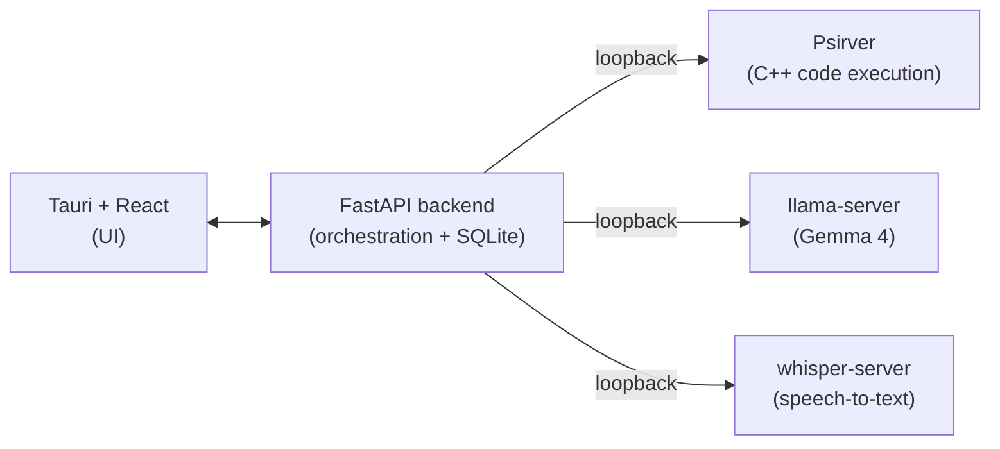

# Whetstone

**A local-first problem-solving environment for CS students. Your code, your reasoning, and an AI tutor - all on your own machine.**


-lightgrey)


> A whetstone is what you sharpen a blade against. This is a surface to sharpen problem-solving skill against - not a machine that hands over answers.

---

## What it is

Whetstone is a desktop app for working through a CS assignment end to end: read the spec, write and run code, get unstuck, and look back at how you got there. It runs an interpreter and an AI tutor locally, so nothing you write leaves your laptop.

Three things make it different from a notebook with a chatbot bolted on:

- **It understands your assignment.** Import a spec (PDF or text) and Whetstone turns the wall of text into a tracked checklist of requirements you can check off as you go.
- **It tutors instead of solving.** A Socratic mode answers your questions with questions and incremental hints. When you genuinely want the answer, you can ask for it - and the app tells you plainly when it's handing you a full solution versus a nudge.
- **It records how you think.** Every edit, run, error, and AI exchange goes into a session timeline you can replay. Think of it as a debugger for your own problem-solving process.

## Why I built it

Most AI coding help is cloud-based and answer-shaped. That's a bad fit for two reasons students feel directly: privacy (your code and your professor's spec get shipped to someone else's server) and learning (a tool that just writes the answer teaches you nothing and walks straight into academic-integrity trouble).

Whetstone takes the opposite stance. Everything runs offline by default, and the design treats the AI as a fallible tutor whose reasoning you verify, not an oracle you copy. The point is to come out the other side actually understanding the problem.

## Status

In active development. The requirements are specified (see [`docs/Whetstone_SRS.md`](docs/Whetstone_SRS.md)), and the execution backend, the Direct-mode tutor, and the core workspace UI are in and tested. Current work is the Socratic tutor, voice input, and the remaining UI wiring. This README describes the v1.0 target; the table below reflects what actually runs today.

| Area | State |
|---|---|
| Software Requirements Spec | Done |
| Psirver async job system (fork/exec, lifecycle, capture) | Done |
| Backend API (sessions, cells, spec, timeline) | Done |
| Cell execution (backend ↔ Psirver, Python + C++) | Done |
| Notebook UI (run / edit cells) | Working — add-cell + cell-reload pending |
| Spec import + requirement tracking | Done |
| Local LLM co-pilot — Direct mode | Done |
| Local LLM co-pilot — Socratic mode | Not started |
| Session event log + timeline endpoint | Done |
| Timeline replay (step-back UI) | Pending |
| Voice input (Whisper STT) | Stub |
| Packaging / one-command run | `make dev` launcher; macOS Tauri bundle (UI shell — services run separately) |

## Architecture

Whetstone is a Tauri + React front end over a local FastAPI backend. The backend talks to three separate local services over loopback (`127.0.0.1`), so a misbehaving model or a runaway program can't take down the rest of the app, and swapping the model is a restart rather than a code change.



Code execution runs through **Psirver**, a C++ HTTP server I originally wrote for an Operating Systems course. It uploads scripts, runs them with `fork`/`execvp`, and tracks each run as a job with captured stdout/stderr, status, and termination. Reusing it here gives Whetstone a sandboxed, independently restartable execution engine - and a real answer to "why an HTTP server inside a local app?" (reuse, isolation, and a clean seam if remote execution ever matters).

## Tech stack

| Layer | Choice |
|---|---|
| Frontend | Tauri + React |
| Backend | FastAPI (Python) |
| Storage | SQLite via SQLModel, with sqlite-vec for semantic search |
| Inference | llama.cpp (`llama-server`), Gemma 4 E4B minimum / 26B A4B recommended |
| Speech-to-text | Whisper (`whisper-server`) |
| Code execution | Psirver (C++), Python and C++ cells |

The stack is shared on purpose across a three-app suite (see below), so the choices read as deliberate architecture rather than three unrelated projects.

## Part of a suite

Whetstone is the third app in a privacy-first student suite:

- **LoomAssist** - local-first calendar and voice assistant for scheduling.
- **Chalkmark** - local-first AI study and note-taking app with branchable, git-style note versions.
- **Whetstone** - this project: the assignment problem-solving environment.

It borrows its backend shape from LoomAssist (Tauri + FastAPI + SQLModel) and its semantic search from Chalkmark (sqlite-vec). The apps run independently but are built to interoperate where it's natural.

## Getting started

Target platform is **macOS on Apple Silicon**. The four backend services come up
with one command (`make dev`); the desktop window is started separately.

### Prerequisites

- macOS on Apple Silicon, 16 GB RAM baseline.
- **Xcode Command Line Tools** — `clang++` for the Psirver build and C++ cells:
  `xcode-select --install`.
- **Python 3.11+** (`python3`).
- **Node.js 18+** and npm.
- **Rust toolchain** + [Tauri prerequisites](https://tauri.app/start/prerequisites/) —
  only needed to build the bundle or run `npm run tauri dev`. You can skip Rust
  and run the UI in a browser (`npm run dev`) instead.
- **`llama.cpp`** built so `llama-server` is on your `PATH` (the LLM co-pilot).
- **`whisper.cpp`** built so `whisper-server` is on your `PATH` (voice input).
- The **model files** (next section). The app's tutor and voice features are
  useless without them.

### Getting the models

The model files are large and are **not** in the repo. By default the launcher
looks in [`models/`](models/) (gitignored); override the paths with
`WHETSTONE_GEMMA_GGUF` and `WHETSTONE_WHISPER_GGML`.

`apps/backend/config.py` only stores the model *names* the backend sends to each
server (`gemma-4-e4b`, `whisper-base`); it never stores a file path. The *path*
is passed to the server by the launcher via `-m`. So "where the model lives" is
a launcher/env concern, and "what it's called" is a config concern.

**1. Gemma GGUF → `models/gemma-4-e4b.gguf`** (for `llama-server`)

Whetstone targets a **Gemma E4B-class** model (the 16 GB-friendly floor; a
larger Gemma is the recommended upgrade — see [`docs/model-eval.md`](docs/model-eval.md)).
Download a Gemma GGUF from Hugging Face and drop it at the default path:

```sh
# Pick a Gemma E4B GGUF (Q4_K_M is a good size/quality balance) and save it as:
huggingface-cli download <gemma-e4b-gguf-repo> <file>.gguf \
  --local-dir models --local-dir-use-symlinks False
mv models/<file>.gguf models/gemma-4-e4b.gguf
```

(Or point `WHETSTONE_GEMMA_GGUF` at wherever you already keep it. llama.cpp's
`llama-server -hf <repo>` can also fetch on first run, but the launcher wants a
local file it can preflight, so the documented default is a file in `models/`.)

**2. Whisper model → `models/ggml-base.bin`** (for `whisper-server`)

whisper.cpp ships a downloader that produces exactly the file we want:

```sh
# from your whisper.cpp checkout:
bash ./models/download-ggml-model.sh base
cp models/ggml-base.bin /path/to/Whetstone/models/ggml-base.bin
```

`base` matches the `whisper-base` name in config. A larger model (`small`,
`medium`) also works — set `WHETSTONE_WHISPER_GGML` to its path.

### Build and run

```sh
# 1. Start the four local services (backend, Psirver, llama-server, whisper-server).
#    First run builds Psirver and the backend venv automatically.
make dev
#    No models yet? Bring up just the backend + Psirver:
make dev ARGS="--skip-llm --skip-stt"

# 2. In a second terminal, start the desktop window:
cd apps/desktop && npm run tauri dev
#    No Rust/Tauri toolchain? Run the UI in a browser instead:
cd apps/desktop && npm run dev   # then open http://localhost:1420
```

`make dev` prints each service, its port, and whether it came up; **Ctrl-C**
tears all four down and frees their ports. If a model file, the Psirver binary,
or a port is missing it fails up front with the exact reason rather than coming
up half-wired. Full detail — ports, env vars, troubleshooting — is in
[`RUNNING.md`](RUNNING.md), and [`SMOKE_TEST.md`](SMOKE_TEST.md) is a click-by-click
acceptance pass.

### Packaging (macOS bundle)

```sh
make bundle    # = cd apps/desktop && npm install && npm run tauri build
```

This produces a `Whetstone.app` and a `.dmg` under
`apps/desktop/src-tauri/target/release/bundle/`. **The bundle packages only the
UI shell** — it does not embed the backend or the model servers. Run `make dev`
alongside the bundled app so it can reach the backend on loopback (the bundled
app's `tauri://localhost` origin is already allow-listed in the backend's CORS
config). Bundling the services as sidecars is a post-v1 item.

## Repository layout

This is a monorepo. The two apps and the standalone execution service are
developed and run independently.

```
whetstone/
├── apps/
│   ├── desktop/            # Tauri + React (TypeScript) front end
│   └── backend/            # FastAPI backend
│       ├── main.py         # app factory, mounts routers
│       ├── db.py           # SQLite engine + session factory (SQLModel)
│       ├── models.py       # SQLModel table stubs
│       ├── config.py       # pydantic-settings configuration
│       ├── routers/        # sessions, cells, ai, spec
│       └── services/       # psirver / llm / stt HTTP client stubs
├── services/
│   └── psirver/            # C++ code-execution backend (placeholder)
├── docs/                   # SRS and design docs
└── README.md
```

## Running locally (development)

`make dev` (see [Build and run](#build-and-run)) is the one-command path and the
recommended way to bring up the stack. To run a single service by hand — for
example the backend with `--reload` for hot-reloading, or one model server in
isolation — follow the per-service steps in [`RUNNING.md`](RUNNING.md). The
desktop app talks to the backend over loopback; the backend in turn talks to
Psirver, llama-server, and whisper-server over loopback (see
[Architecture](#architecture)).

## Roadmap

The build order, roughly:

1. Finish the Psirver async job system (the execution spine).
2. Notebook and cell execution wired to Psirver.
3. Local LLM co-pilot in direct mode.
4. Spec parsing and requirement tracking.
5. Session event log and timeline replay.
6. Socratic mode and voice input.
7. Stretch: session branching, suite interop, export polish, sandbox hardening.

See the [SRS](docs/Whetstone_SRS.md) for the full requirements, diagrams, and design decisions.

## License

To be determined.

---

*Built by Allan as part of an ongoing exploration of local-first, privacy-respecting tools for students.*
