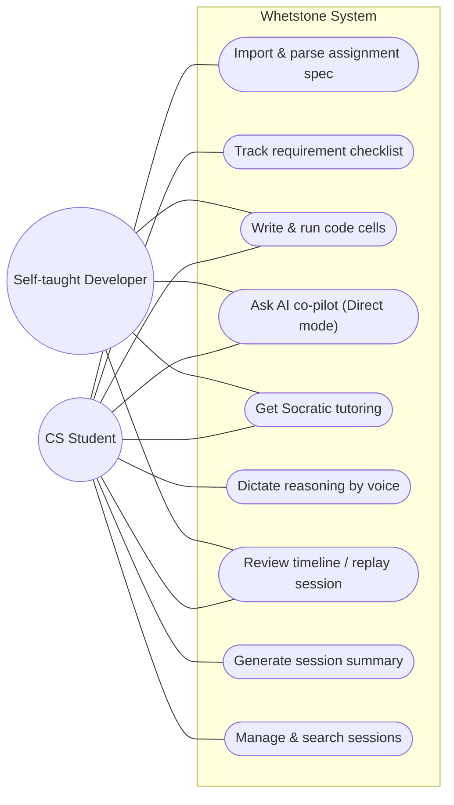
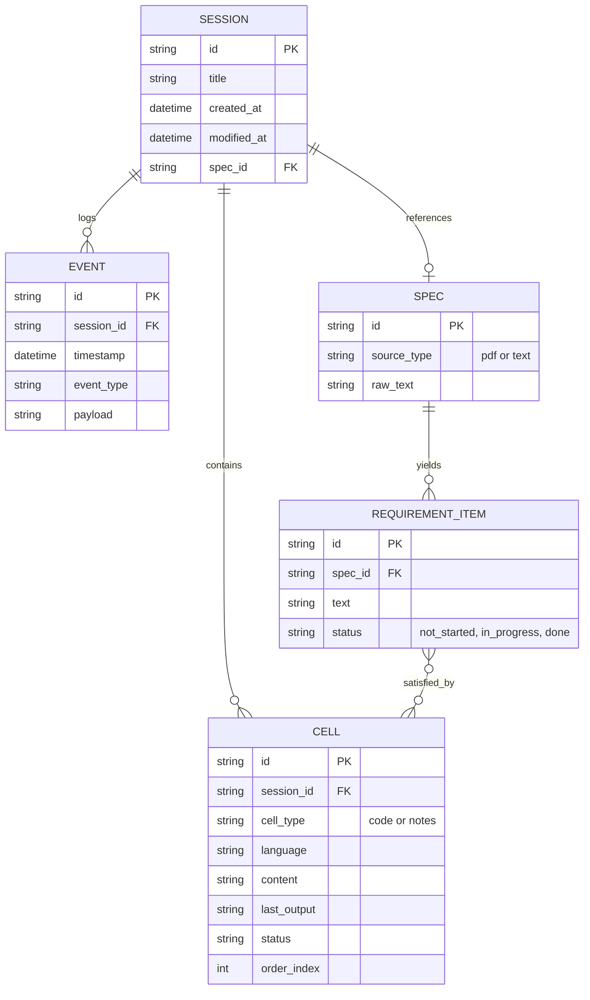
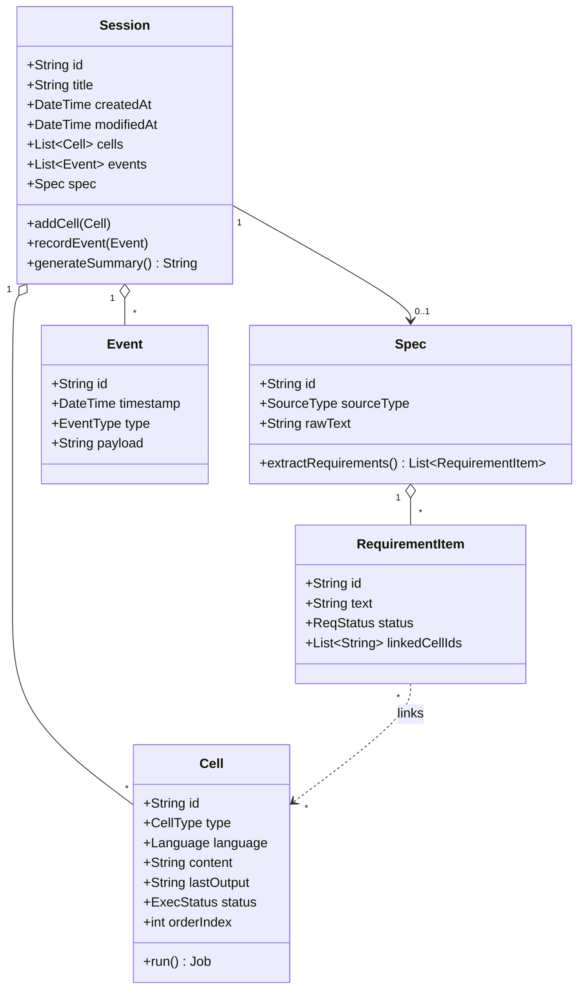
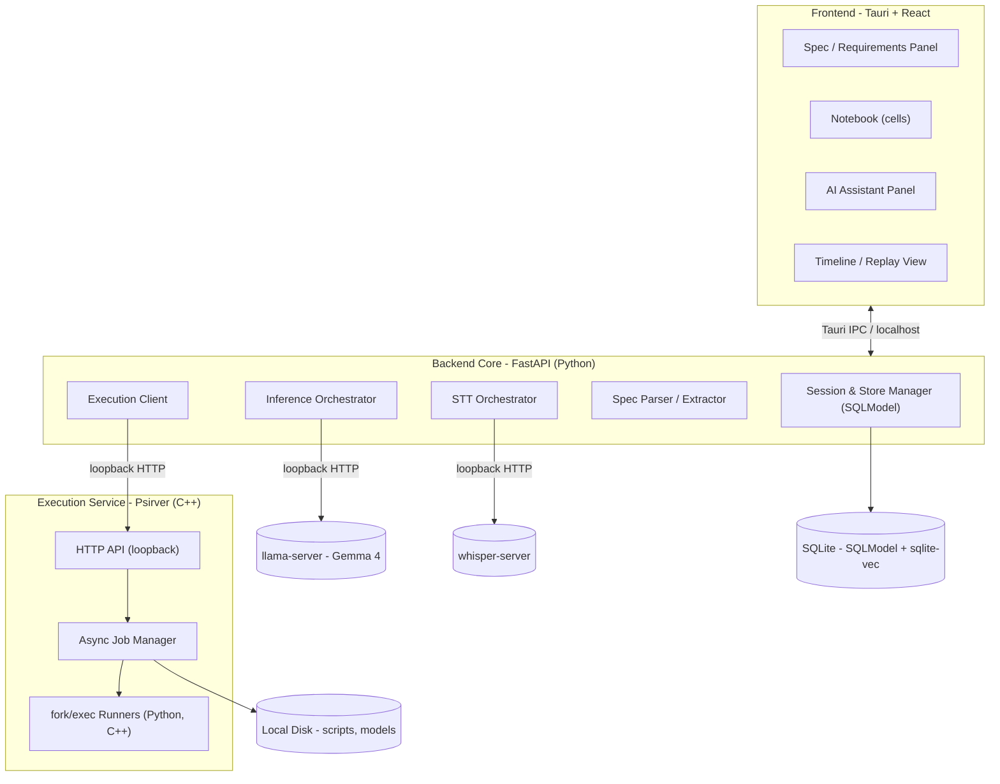
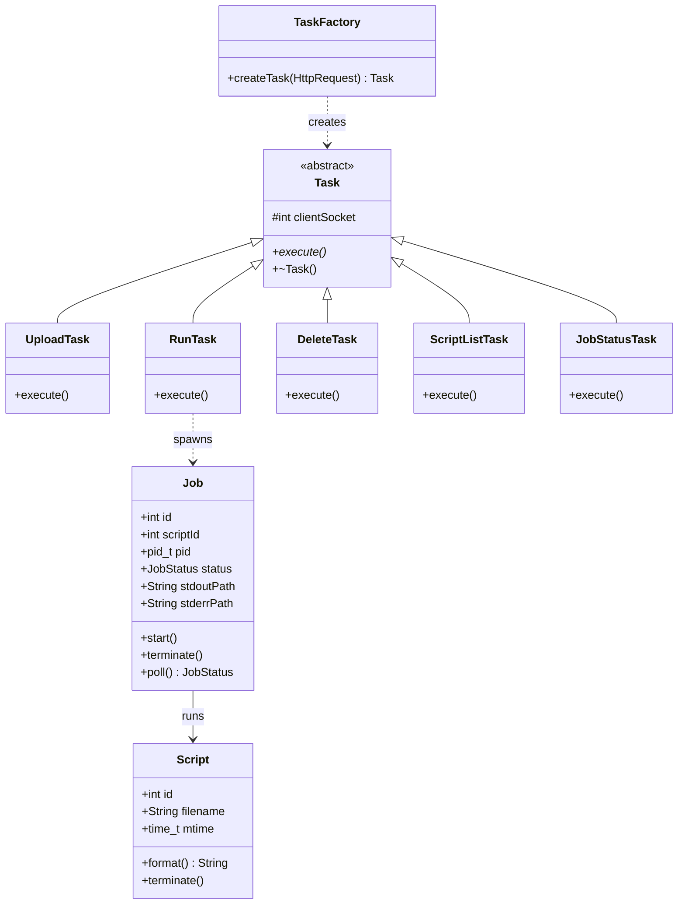
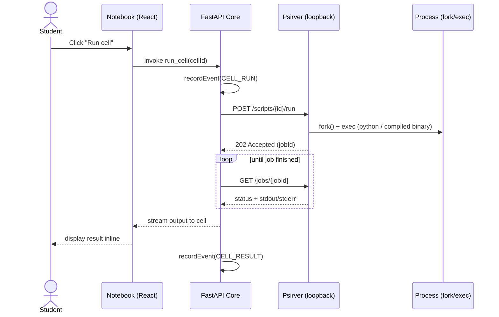
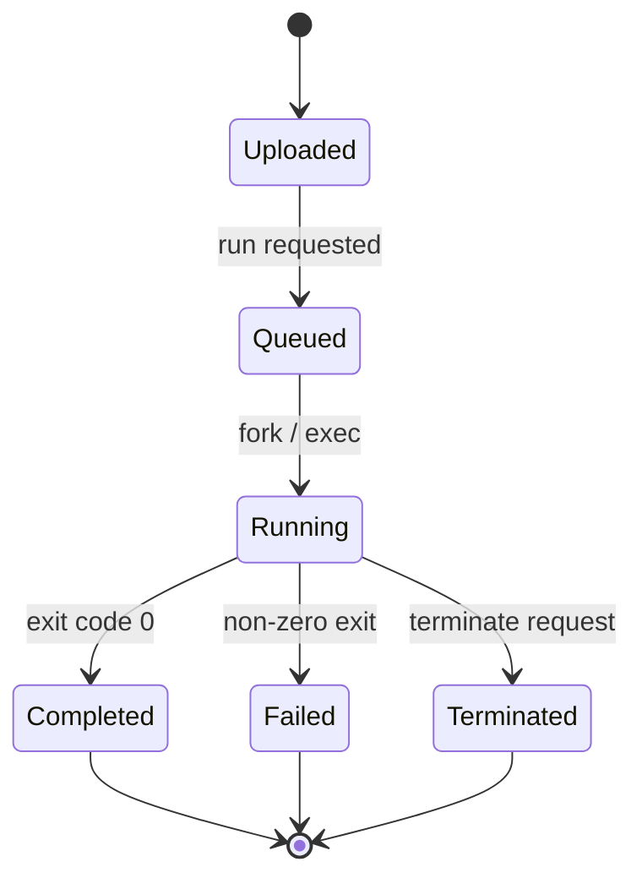

# Software Requirements Specification

## Whetstone — A Local-First CS Problem-Solving Environment

| | |
|---|---|
| **Document version** | 1.2 (Draft) |
| **Status** | Draft for review |
| **Author** | Allan |
| **Date** | May 28, 2026 |
| **Part of** | Student Educational Suite (LoomAssist, Chalkmark, Whetstone) |
| **Supersedes** | *Stacktrace* SRS v1.0 (renamed; execution backend now built on Psirver). v1.1 superseded by stack decision: FastAPI + SQLModel backend, loopback model servers. |

---

## Table of Contents

1. [Introduction](#1-introduction)
2. [Overall Description](#2-overall-description)
3. [External Interface Requirements](#3-external-interface-requirements)
4. [System Features and Functional Requirements](#4-system-features-and-functional-requirements)
5. [Non-Functional Requirements](#5-non-functional-requirements)
6. [Data Requirements](#6-data-requirements)
7. [System Architecture Overview](#7-system-architecture-overview)
8. [Constraints, Assumptions, and Dependencies](#8-constraints-assumptions-and-dependencies)
9. [Appendices](#9-appendices)

---

## 1. Introduction

### 1.1 Purpose

This document specifies the requirements for **Whetstone**, a desktop application that provides computer science students with an interactive problem-solving environment combining a code scratchpad, an on-device AI tutor, and assignment-aware progress tracking. It defines the functional and non-functional requirements for the initial release (v1.0 of the product) and is intended for the developer, future contributors, and reviewers evaluating the project.

The name reflects the product's purpose: a *whetstone* is what you sharpen a blade against. Whetstone is a surface to sharpen problem-solving skill against, not a machine that hands over answers.

### 1.2 Scope

Whetstone is the third application in a privacy-first educational suite. Where **LoomAssist** handles scheduling and **Chalkmark** handles note-taking and tutoring, Whetstone targets the specific workflow of *working through a CS assignment*: understanding a specification, writing and running code, getting unstuck, and reflecting on the reasoning that led to a solution.

The product will:

- Parse an assignment specification into a tracked requirement checklist.
- Provide an interactive, cell-based coding environment with local execution, powered by the **Psirver** execution service (see §1.6).
- Offer an on-device LLM co-pilot that explains errors, analyzes complexity, and tutors Socratically rather than supplying answers.
- Accept voice input for capturing reasoning out loud.
- Record a replayable session timeline of the problem-solving process.

The product will **not**, in v1.0:

- Replace a full IDE (no project-wide refactoring, debugging breakpoints, or build toolchains beyond single-file compile-and-run).
- Submit, grade, or integrate with institutional LMS platforms.
- Require or transmit any data to the cloud for its core functionality.

### 1.3 Definitions, Acronyms, and Abbreviations

| Term | Definition |
|---|---|
| **Cell** | A discrete, independently executable unit of code or notes within a session, analogous to a Jupyter cell. |
| **Session** | A single problem-solving working session tied to one assignment or scratch context. |
| **Spec** | An assignment specification document supplied by the user (PDF or plain text). |
| **Requirement item** | A discrete, trackable obligation extracted from a spec (e.g., "function must run in O(n log n)"). |
| **Socratic mode** | An AI interaction mode that responds with guiding questions rather than direct solutions. |
| **Session replay** | A chronological reconstruction of a session showing code changes, runs, and AI interactions over time. |
| **Psirver** | The script-running HTTP execution service (C++) used as Whetstone's sandboxed code-execution backend. |
| **Job** | A single execution of a script/cell tracked by Psirver, with an ID, status, and captured output. |
| **LLM** | Large Language Model (run locally via llama.cpp). |
| **STT** | Speech-to-Text (Whisper). |
| **SRS** | Software Requirements Specification (this document). |

### 1.4 References

- IEEE Std 830-1998, *Recommended Practice for Software Requirements Specifications*.
- ISO/IEC/IEEE 29148:2018, *Systems and software engineering — Requirements engineering*.
- LoomAssist and Chalkmark design documents (internal, same suite).
- Psirver project documentation (internal; originated as an Operating Systems course project).

### 1.5 Overview

Section 2 describes the product context and its users. Sections 3–6 contain the detailed requirements. Section 7 covers the architecture and the major diagrams. Section 8 lists constraints and assumptions. Requirement identifiers (e.g., `FR-SPEC-1`) are used throughout for traceability.

### 1.6 Relationship to Psirver

Whetstone's code-execution backend is **Psirver**, a lightweight C++ HTTP server originally built for an Operating Systems course. Psirver already accepts uploaded scripts, runs them via `fork`/`execvp`, and exposes a REST-like API; its planned next phase — asynchronous (non-blocking) execution, captured stdout/stderr via pipes, and job tracking with IDs, status, and termination — maps directly onto Whetstone's execution requirements. Whetstone runs Psirver as a **loopback-only** service (bound to `127.0.0.1`), so this reuse reinforces both the local-first privacy guarantee and the architectural separation between code execution and AI inference. Completing Psirver's job system is therefore in scope as part of building this backend.

---

## 2. Overall Description

### 2.1 Product Perspective

Whetstone is a self-contained desktop application that shares architectural conventions with its sibling apps but operates independently. It reuses the suite's established technology choices: a **Tauri + React** frontend with a **local FastAPI (Python) backend over SQLite via SQLModel** (as in LoomAssist), and **local llama.cpp inference with Whisper STT** (as in Chalkmark). Semantic search over past sessions reuses **sqlite-vec**, the vector-search extension already used in Chalkmark. Code execution is delegated to the **Psirver** service over loopback. It does not depend on the other apps being installed, but it is designed to interoperate with them where natural (see §2.7).

The local backend orchestrates four loopback subprocesses behind one uniform pattern — Psirver (code execution), `llama-server` (inference), and `whisper-server` (STT) — so the same supervision and restart logic (NFR-REL-3) applies to each. This mirrors LoomAssist's frontend/backend split rather than embedding logic in Tauri's native Rust layer, keeping two of the three suite apps on an identical data-access stack.

### 2.2 Product Functions and Use Cases

At a high level, Whetstone allows a user to import an assignment spec and generate a tracked requirement checklist; write, edit, and run code in an interactive cell-based notebook; receive AI assistance scoped to the current assignment; toggle between direct help and Socratic tutoring; dictate reasoning via voice; review a replayable timeline; and export a session summary.

The primary use cases and actors are shown below.

### 2.3 User Characteristics

The primary user is an **undergraduate computer science student** who is comfortable writing code but may be learning data structures, algorithms, and systems concepts for the first time. They are privacy-conscious and concerned about academic integrity. A secondary user is a **self-taught developer** working through practice problems. Both expect a responsive desktop tool and have at least one programming language they are fluent in.

### 2.4 Operating Environment

- **Platform:** macOS (primary, consistent with LoomAssist). Architecture should not preclude later Windows/Linux builds via Tauri.
- **Hardware:** Apple Silicon assumed for v1.0; **16 GB RAM** is the reference baseline.
- **Languages supported for execution (v1.0):** Python and C++, given the user's coursework. Additional languages are out of scope for v1.0.
- **C++ toolchain:** Whetstone **assumes a system toolchain** (`clang` via Xcode Command Line Tools), mirroring how Psirver already assumes the Python runtime is present on the host. The toolchain is detected at startup and, if absent, the user is guided to install it. A compiler is **not** bundled.
- **Local model:** The reference model is **Gemma 4 E4B** (quantized), which is the minimum supported model and runs comfortably within the 16 GB baseline. Where additional RAM is available (≈24 GB+), the **Gemma 4 26B A4B** MoE model is the recommended target for materially stronger reasoning. The model is **pluggable** (see §4.3), so upgrading is a configuration change, not a code change.

### 2.5 Design and Implementation Constraints

- All core features must function fully offline.
- Inference must run on-device via llama.cpp; no external API calls for AI features in the default configuration.
- Code execution must be sandboxed (via Psirver) to limit damage from arbitrary user or AI-suggested code.
- The UI stack is fixed to Tauri + React, with a local FastAPI (Python) backend, for suite consistency with LoomAssist.
- Persistent storage shall use SQLite (via SQLModel), with sqlite-vec for semantic search, consistent with the rest of the suite.
- The execution service (Psirver) and the local model servers must bind to loopback only.

### 2.6 AI Capability Assumptions

The reference model is small (4B effective parameters), so the design treats AI output as **fallible and verifiable**, not authoritative — see §4.3 and §4.4. This is both an accurate reflection of a small local model's limits and a deliberate pedagogical stance: the product's value is in sharpening the student's own judgment, not replacing it.

### 2.7 Suite Interoperability (Optional, Lower Priority)

- Whetstone **may** export concept explanations or generated cards to Chalkmark's note/flashcard store.
- Whetstone **may** register assignment deadlines parsed from a spec with LoomAssist's calendar.

These are desirable but not required for v1.0.

---

## 3. External Interface Requirements

### 3.1 User Interfaces

- **UI-1:** The application shall present a primary three-pane layout: a requirement/spec panel, a central cell-based notebook, and an AI assistant panel.
- **UI-2:** The AI assistant panel shall clearly indicate the current mode (Direct vs. Socratic).
- **UI-3:** The interface shall provide a session timeline view accessible from the main window.
- **UI-4:** The interface shall provide a visible, unambiguous indicator of voice recording state when STT is active.
- **UI-5:** The interface shall provide a persistent indicator confirming that the app is operating offline / on-device.
- **UI-6:** When the AI is reasoning (thinking mode), the interface shall show a non-blocking "reasoning…" state rather than appearing frozen.

### 3.2 Hardware Interfaces

- **HW-1:** The application shall access the system microphone for voice input, only while recording is explicitly active.
- **HW-2:** The application shall utilize available GPU/Neural Engine acceleration for inference where the platform permits.

### 3.3 Software Interfaces

- **SW-1:** The application shall invoke a local llama.cpp runtime (`llama-server`) for all LLM inference, over a loopback HTTP interface.
- **SW-2:** The application shall invoke a local Whisper model (`whisper-server` or equivalent) for all speech-to-text, over a loopback HTTP interface.
- **SW-3:** The application shall execute user code through the **Psirver** service over a loopback HTTP interface, using its job API (submit, poll status, fetch stdout/stderr, terminate).
- **SW-4:** The application shall persist session data to a local **SQLite** database accessed via **SQLModel**, mirroring LoomAssist's data layer.
- **SW-5:** The C++ runner within Psirver shall invoke the system `clang`/`clang++` toolchain to compile before executing C++ cells.
- **SW-6:** The application shall use **sqlite-vec** for semantic search across past sessions (FR-MGT-3) and, where useful, for retrieving relevant prior cells as AI context.

### 3.4 Communications Interfaces

- **COM-1:** The application shall not require any network connection for core functionality.
- **COM-2:** All communication with Psirver and the local model servers (`llama-server`, `whisper-server`) shall occur over the loopback interface (`127.0.0.1`) and shall never be exposed on an external network address.
- **COM-3:** If optional cloud or model-download features are added, the application shall request explicit user consent before any network transmission and shall disclose exactly what is sent.

---

## 4. System Features and Functional Requirements

Each requirement has a unique ID and a priority: **(H)** High / must-have for v1.0, **(M)** Medium, **(L)** Low / stretch.

### 4.1 Spec Parsing and Requirement Tracking

> *The differentiating feature: turn a wall-of-text assignment into a tracked checklist.*

- **FR-SPEC-1 (H):** The system shall allow the user to import an assignment spec as a PDF or plain-text file, or by pasting text directly.
- **FR-SPEC-2 (H):** The system shall use the local LLM to extract discrete requirement items from the imported spec.
- **FR-SPEC-3 (H):** The system shall display extracted requirement items as a checklist, each with a status of *Not started*, *In progress*, or *Done*.
- **FR-SPEC-4 (H):** The system shall allow the user to manually add, edit, delete, and reorder requirement items, since extraction will be imperfect.
- **FR-SPEC-5 (M):** The system shall allow the user to associate one or more notebook cells with a given requirement item.
- **FR-SPEC-6 (M):** The system shall, on request, ask the LLM to assess whether the user's current code appears to satisfy a selected requirement item and surface the reasoning as an advisory the user can verify.
- **FR-SPEC-7 (M):** The system shall flag when the user's stated approach appears to diverge from a constraint in the spec (e.g., a complexity bound), and shall present this as a non-blocking advisory.
- **FR-SPEC-8 (L):** The system shall extract any deadline mentioned in the spec and offer to export it (see §2.7).

### 4.2 Interactive Notebook / Scratchpad

- **FR-NB-1 (H):** The system shall provide a notebook composed of ordered cells, where each cell is either a code cell or a markdown/notes cell.
- **FR-NB-2 (H):** The system shall execute the contents of a code cell on demand via Psirver and display its output (stdout, stderr, and exit status) inline.
- **FR-NB-3 (H):** The system shall support Python and C++ execution. C++ cells shall be compiled with the system toolchain (SW-5) and then run.
- **FR-NB-4 (H):** The system shall allow the user to add, delete, reorder, re-run, and terminate cells/jobs independently.
- **FR-NB-5 (H):** The system shall preserve execution state across cells **for interpreted languages only** (e.g., Python variables persisting across cells). **Compiled languages (C++) shall treat each run as a discrete, self-contained program** with no cross-cell state, since there is no native session concept and faking one is not justified for v1.0.
- **FR-NB-6 (M):** The system shall provide syntax highlighting appropriate to each cell's language.
- **FR-NB-7 (L):** The system shall allow attaching a small input/test harness to a code cell to validate output against expected values.

### 4.3 AI Co-Pilot (Direct Mode)

- **FR-AI-1 (H):** The system shall allow the user to ask the AI a free-form question with the current cell, recent output, and active requirement items provided as context.
- **FR-AI-2 (H):** When a code cell produces an error, the system shall offer to explain the error in plain language, including the likely cause.
- **FR-AI-3 (H):** All AI inference shall be performed by the local LLM with no transmission of code off-device.
- **FR-AI-4 (M):** The system shall, on request, analyze the time and space complexity of a selected code cell. Because the reference model is small, this output **shall be framed as the tutor's reasoning for the student to verify**, not as an authoritative result.
- **FR-AI-5 (M):** The system shall, on request, suggest one or more solution approaches at a conceptual level without writing the full solution, unless the user explicitly requests code.
- **FR-AI-6 (H):** The system shall make explicit, in any response, when it is providing a complete solution versus a hint, so the user is aware of the integrity implications.
- **FR-AI-7 (H):** The system shall allow the user to select among installed local models (e.g., Gemma 4 E4B and 26B A4B), so a user with more RAM can opt into a stronger model without any change to application code.
- **FR-AI-8 (M):** For reasoning-heavy tasks (complexity analysis, Socratic dialogue), the system shall enable the model's thinking mode and present its progress via the non-blocking reasoning state (UI-6).

### 4.4 Socratic Tutoring Mode

> *The mode that makes this a learning tool rather than an answer machine.*

- **FR-SOC-1 (H):** The system shall provide a Socratic mode that, when active, responds to user questions with guiding questions and incremental hints rather than direct answers.
- **FR-SOC-2 (H):** The system shall make the active mode (Direct vs. Socratic) visually unambiguous and switchable at any time.
- **FR-SOC-3 (M):** In Socratic mode, the system shall escalate the specificity of hints if the user remains stuck across successive exchanges.
- **FR-SOC-4 (M):** The system shall allow the user to "give up" on a hint chain and reveal a direct explanation, recording that this occurred in the session timeline.
- **FR-SOC-5 (M):** The system shall constrain the model with a system prompt designed to maintain Socratic restraint, since a small model is more prone to volunteering the answer; behavior under this constraint is an explicit test target (see §9.3).

### 4.5 Voice Input

- **FR-VOICE-1 (H):** The system shall allow the user to dictate text via the local Whisper model into a notes cell or the AI prompt.
- **FR-VOICE-2 (H):** All speech-to-text processing shall occur on-device.
- **FR-VOICE-3 (M):** The system shall timestamp dictated reasoning and attach it to the session timeline.
- **FR-VOICE-4 (L):** The system shall allow a hands-free "think aloud" capture mode that transcribes continuously until stopped.

### 4.6 Session Timeline and Replay

> *The "debugger for your own thinking" feature — strong portfolio and interview talking point.*

- **FR-SESS-1 (H):** The system shall record a chronological log of session events: cell edits, executions, errors, AI exchanges, mode switches, and dictated notes.
- **FR-SESS-2 (H):** The system shall present a timeline view that lets the user step through the recorded events in order.
- **FR-SESS-3 (M):** The system shall allow the user to jump to the state of a specific cell at a chosen point in the timeline.
- **FR-SESS-4 (M):** The system shall generate, on request, a concise written summary of the session: what was attempted, where the user got stuck, and how they got unstuck. The summary shall be generated by the **same local model** (no second model loaded into memory) as a **non-blocking background job**, with a generous latency budget since it is not interactive. Because the reference model supports a 128K context window, the full session log will typically be summarized in a single pass; hierarchical summarization is a fallback for unusually long sessions.
- **FR-SESS-5 (M):** The system shall allow exporting a session (timeline and/or summary) to a portable file (e.g., Markdown or JSON).
- **FR-SESS-6 (L):** The system shall support annotating timeline events with the user's own reflections.

### 4.7 Session and Workspace Management

- **FR-MGT-1 (H):** The system shall allow the user to create, name, save, and reopen sessions.
- **FR-MGT-2 (H):** The system shall persist all session data locally between launches.
- **FR-MGT-3 (M):** The system shall allow the user to search across past sessions by title, content, or associated spec.
- **FR-MGT-4 (L):** The system shall support a DAG-based versioning model for session branches, consistent with Chalkmark's versioning engine, allowing the user to fork a session and explore alternative approaches.

---

## 5. Non-Functional Requirements

### 5.1 Performance

- **NFR-PERF-1 (H):** A code cell of typical size shall begin executing within 500 ms of the user invoking it, excluding the runtime of the user's own code and (for C++) compilation time.
- **NFR-PERF-2 (H):** The AI assistant shall produce its first **visible** token within a target of 3 seconds on the reference hardware (Apple Silicon, 16 GB RAM, Gemma 4 E4B) for a typical prompt. For thinking-mode tasks, the reasoning pass runs behind the non-blocking reasoning state.
- **NFR-PERF-3 (H):** The UI shall remain responsive (no frozen frames) during inference and code execution, both of which shall run off the main UI thread.

### 5.2 Privacy and Security

- **NFR-PRIV-1 (H):** No user code, spec content, notes, voice data, or AI prompt shall leave the device under the default configuration.
- **NFR-SEC-1 (H):** User and AI-suggested code shall be executed by Psirver in a sandboxed environment with restricted filesystem and network access; the v1.0 baseline includes read-only locking of stored scripts, with resource limits and stronger isolation (e.g., namespaces/seccomp) as planned hardening. (See the README's *Code execution & sandboxing* section for the operational threat model, the configurable `PSIRVER_LIMIT_*` limits, and the documented v1.0 boundaries.)
- **NFR-SEC-2 (H):** The application shall warn the user before executing any code that the AI has generated, distinguishing it from code the user wrote.
- **NFR-SEC-3 (H):** Psirver shall bind only to the loopback interface and shall reject connections from non-local addresses.
- **NFR-PRIV-2 (M):** Local session data shall be stored in a location under the user's control, and the user shall be able to delete any session permanently.

### 5.3 Usability

- **NFR-USE-1 (H):** A new user shall be able to import a spec, write and run a cell, and ask the AI a question without consulting external documentation.
- **NFR-USE-2 (M):** Keyboard shortcuts shall exist for the most frequent actions (run cell, new cell, toggle mode, start/stop voice).

### 5.4 Reliability

- **NFR-REL-1 (H):** A crash or forced quit shall not lose more than the last few seconds of session work; sessions shall be autosaved.
- **NFR-REL-2 (H):** A failure in code execution or inference shall be reported gracefully without crashing the application.
- **NFR-REL-3 (M):** If the Psirver service becomes unavailable, the application shall surface a clear error and allow the user to restart the execution backend without losing session data.

### 5.5 Maintainability and Portability

- **NFR-MAINT-1 (M):** The frontend (Tauri + React), the inference/STT backend, and the execution service (Psirver) shall be separated by well-defined interfaces so each can evolve independently.
- **NFR-PORT-1 (L):** The architecture shall avoid macOS-only dependencies in the core logic so that a future Tauri build for other platforms is feasible.

---

## 6. Data Requirements

### 6.1 Entities

- **DATA-1:** A **Session** entity shall store: identifier, title, creation/modification timestamps, associated spec reference, ordered cells, and the event log.
- **DATA-2:** A **Cell** entity shall store: identifier, type (code/notes), language, content, last output, execution status, and order index.
- **DATA-3:** A **RequirementItem** entity shall store: identifier, source spec reference, text, status, and any associated cell references.
- **DATA-4:** A **Spec** entity shall store: identifier, source type, and raw text.
- **DATA-5:** An **Event** entity (for the timeline) shall store: identifier, timestamp, type, and a payload describing the change.
- **DATA-6:** All entities shall be serializable to a local, portable format to support export and (optionally) DAG-based versioning.
- **DATA-7:** Entities shall be persisted in a local **SQLite** database via **SQLModel**. In v1, **Session** and **Cell** hold their own mutable state (content, last output, status, etc.); this mutable state is intentional and authoritative. The **Event** log is an **append-only audit/timeline record** used for replay and summary — **not** the canonical source of truth, and v1 does **not** derive Session/Cell state from events. (A fuller event-sourced model where state is derived from the log is a deliberate post-v1 goal, not a v1 requirement.) The database shall run in WAL mode to support the autosave/crash-resilience requirement (NFR-REL-1), and full-text/semantic search (FR-MGT-3) shall be served by SQLite FTS5 and/or sqlite-vec.

### 6.2 Entity-Relationship Diagram

### 6.3 Domain Class Model

---

## 7. System Architecture Overview

This section is informative. It describes a structure consistent with the requirements above.

### 7.1 Component Architecture

Key architectural decisions worth documenting for review and interviews:

- **Three-way separation of concerns** between AI inference, STT, and code execution, each behind its own interface. A misbehaving model or a runaway user program cannot compromise the others.
- **Event-sourced session model**: the timeline is not a bolt-on log but the canonical record from which session state is derived, which is what makes replay and summary generation natural.
- **Uniform loopback-subprocess pattern.** Code execution (Psirver), inference (`llama-server`), and STT (`whisper-server`) all run as separate local services the FastAPI backend talks to over `127.0.0.1`. Solving supervision and restart once (NFR-REL-3) covers all three, model-swapping (FR-AI-7) becomes a point-and-restart, and it gives a defensible answer to "why an HTTP server for a local app?" (reuse, isolation, and a future remote-execution seam).
- **Suite-consistent stack**: Tauri + React with a FastAPI + SQLModel backend (as in LoomAssist) and llama.cpp + Whisper + sqlite-vec (as in Chalkmark), demonstrating deliberate cross-application architecture rather than ad hoc choices.

### 7.2 Execution Backend Class Model (Psirver)

Psirver routes each HTTP request to a concrete `Task` via the **Factory Method** pattern, runs each task in a detached thread, and (in the completed job phase) tracks executions as `Job` objects.

### 7.3 Sequence: Running a Code Cell

This shows the end-to-end path for executing a cell, including the asynchronous job polling that Psirver's job phase introduces.

### 7.4 Job Lifecycle (State)

The job lifecycle corresponds to Psirver's planned asynchronous execution phase (non-blocking run, captured output, status, and termination).

---

## 8. Constraints, Assumptions, and Dependencies

### 8.1 Assumptions

- The user's machine can run Gemma 4 E4B at usable speed (Apple Silicon, 16 GB RAM baseline).
- The user has, or will install when prompted, a Python runtime and the system C++ toolchain (Xcode Command Line Tools).
- Specs are supplied as reasonably structured text or PDF; extraction quality degrades for scanned-image specs without OCR (OCR is out of scope for v1.0).

### 8.2 Dependencies

- **llama.cpp** (`llama-server`) with **Gemma 4 E4B** (minimum) / **26B A4B** (recommended) for local inference.
- **Whisper** (or equivalent local model, e.g. `whisper-server`) for STT.
- **Tauri** runtime and a React toolchain.
- **FastAPI** (Python) backend with **SQLModel** over **SQLite**, plus **sqlite-vec** for semantic search.
- **Psirver** (C++ HTTP execution service) as the code-execution backend.
- The system **clang/clang++** toolchain for C++ compilation.

### 8.3 Out of Scope for v1.0

- Multi-user collaboration.
- Cloud sync (deferred; Chalkmark already owns the encrypted-sync pattern if needed later).
- Full IDE features (breakpoint debugging, multi-file projects, package management).
- Languages beyond Python and C++.
- Persistent cross-cell state for compiled languages.
- Automated grading or LMS submission.

---

## 9. Appendices

### 9.1 Requirement Priority Summary

| Priority | Intent |
|---|---|
| High (H) | Core MVP — defines a usable, demonstrable v1.0 |
| Medium (M) | Depth features that distinguish the project |
| Low (L) | Stretch goals / portfolio polish |

### 9.2 Suggested Build Order (Informative)

1. **Finish the Psirver job system** (async fork/exec, piped stdout/stderr capture, job IDs/status/terminate) — the execution spine everything attaches to, and a self-contained OS-skills deliverable.
2. **Notebook + cell execution over Psirver** (§4.2) — wire the frontend to the backend.
3. **Local LLM co-pilot in Direct mode** (§4.3) — proves the inference integration; verify Gemma 4 E4B quality.
4. **Spec parsing + requirement tracking** (§4.1) — the headline differentiator.
5. **Session event log + timeline** (§4.6) — turns it into a *system*.
6. **Socratic mode** (§4.4) and **voice input** (§4.5) — the learning and capture layers.
7. **Stretch:** DAG versioning, suite interop, export polish, security hardening (NFR-SEC-1).

### 9.3 Open Questions for Review

Most v1.0 design questions are now resolved (C++ toolchain assumed from the system; per-cell state for interpreted languages only; Gemma 4 E4B as the minimum model with 26B A4B as the recommended upgrade; session summaries generated by the same model as a non-blocking job). Remaining items to validate empirically rather than assume:

- **Is Gemma 4 E4B's complexity analysis reliable enough** on the kinds of code students actually write, or should the UI lean harder on the "verify this" framing and recommend the 26B model for that feature specifically?
- **Can the Socratic system prompt hold the model's restraint** across a multi-turn hint chain on a 4B model, and how should the "give up / reveal" escalation (FR-SOC-4) be tuned?
- **What is the right v1.0 security floor for Psirver** when running AI-generated (not just user-written) code — which resource limits are worth adding before release versus deferring to hardening?
- **Event ordering currently relies on timestamp only** — same-millisecond events have undefined relative order. A monotonic sequence column would fix this before the timeline gets heavy write traffic (cell edits can fire fast).

---

*End of document.*
